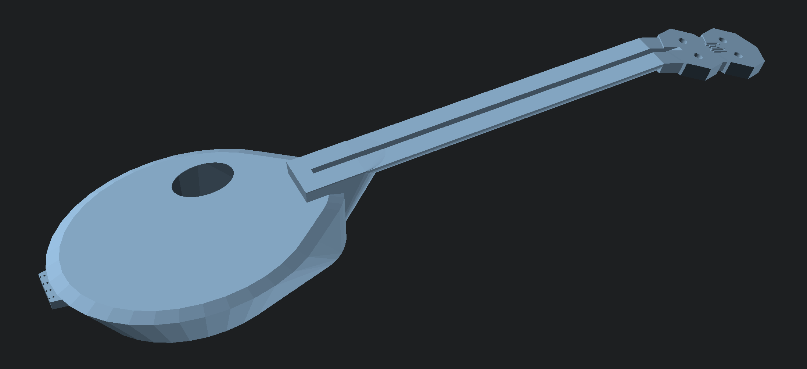

# Mini-Tenor Guitar

This is a mini-sized 4-string tenor guitar, intended to be strung using either nylon strings, or extra-light
gauge metal strings.

Everything is printed, _except_:
* a set of tuners with 10mm posts. (I use [these](https://www.amazon.com/gp/product/B0789YL6JF/ref=ppx_yo_dt_b_search_asin_image?ie=UTF8&psc=1).)
* A set of nylon guitar strings.
* A 12 1/4 inch truss rod (I used [this from StewMac](https://www.amazon.com/gp/product/B07HPBZ3NH/ref=ox_sc_act_title_1?smid=A1BA2XBPZFTT2S&psc=1)).

Assembly should be pretty obvious.

I'm printing this from PLA. At least on my Mk4, I find that ABS tends to
end up slightly porous due to adhesion issues, and any leaks have a big
effect on the sound, and PETG flexes too much.

## The Model

I started with a model written in standard OpenSCAD. That was a bit of a mess; I rewrote it partially using the BOSL libraries for OpenSCAD, which was a big improvement, but I was still struggling to make it come out the way I wanted, because honestly, OpenSCAD is a pretty terrible language.

So I wrote my own.

The latest version is implemented in [Simplex](https://github.com/MarkChuCarroll/simplex), a 3d modelling
language that I built on top of the Manifest library. This
version of the model is contained in the file "mtenor.s3d".

The running the simplex model through the interpreter, you'll
get a collection of products:
* `mtenor-out-body-[ab].stl` - the printable STL files for the
  two halves of the body.
* `mtenor-out-neck-[abc].stl` - the printable STL files for
   the three parts of the neck.
* `mtenor-out-fretboard-[ab].stl` - the printable STL files
   for the two sections of the fretboard.
* `mtenor-out-assembled.stl` - a _non-printable_ STL file
  to see what the guitar should look like once assembled.
